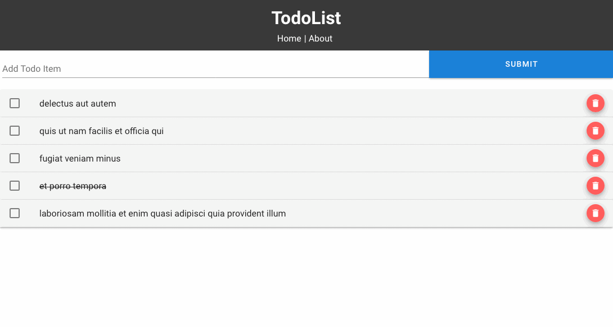

# todoapp

Simple front end app to learn Vue.js and Vuetify.

What am I using:
* vue.jsjs / vuetify - for front end.
* [JsonPlaceHolder](https://jsonplaceholder.typicode.com/) - to call an api to fill in my todo list.
* [axios](https://www.npmjs.com/package/axios) - to make http request.

What functions you can perform on this app:
* Mark an item as complete (clicking the checkbox)
* Delete an item (clicking the trash icon)
* Add an item

## Gif demonstration




## Project setup
```
npm install
```

### Compiles and hot-reloads for development
```
npm run serve
```
On your web browser, access the app by going to: localhost:8080


### Lints and fixes files
```
npm run lint
```

